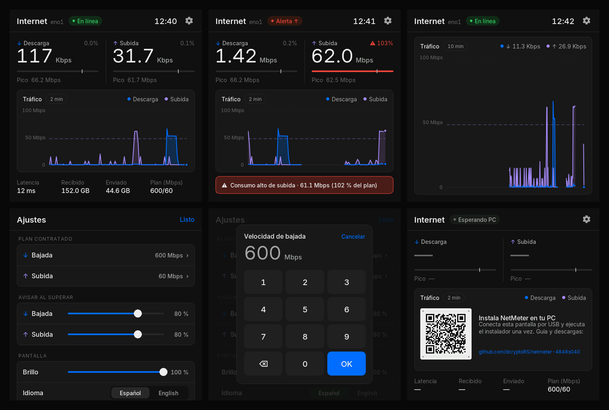
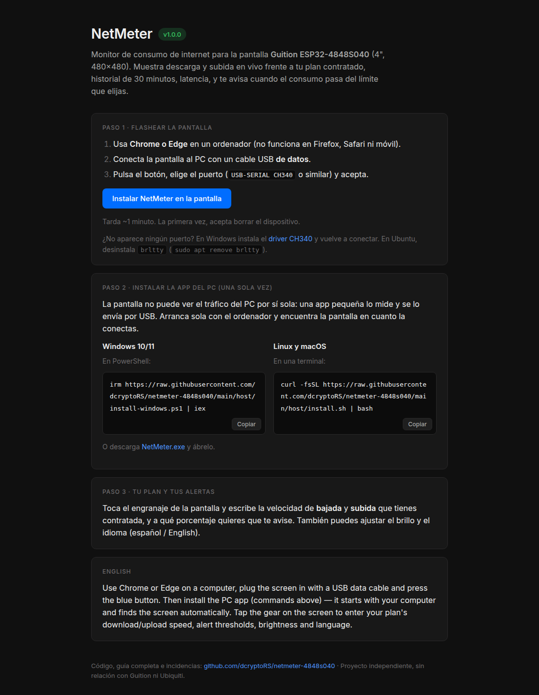

# NetMeter

A desk monitor for your internet connection, for the **Guition ESP32-4848S040**
(4" 480×480 touch screen, ESP32-S3). Live download and upload against the plan
you pay for, a real 30-minute history, latency, and alerts when usage crosses
the threshold you choose. Works with Windows, macOS and Linux.

**[Install it from your browser →](https://dcryptoRS.github.io/netmeter-4848s040/)** ·
[Guía completa en español](INSTRUCCIONES.txt) ·
[Releases](https://github.com/dcryptoRS/netmeter-4848s040/releases/latest)



<sub>Real captures from the device: dashboard, an upload alert, the expanded chart, settings, the plan keypad, and the first-boot screen.</sub>

## What it does

- **Download and upload in real time**, in Kbps / Mbps / Gbps — bits per second, the unit your ISP sells.
- **% of your plan** for each direction. Everyone's plan is different, so you enter yours once (e.g. 600/600, 1000/1000, 300/30); it is stored on the screen itself.
- **Alerts** per direction at a % of the plan you pick (10–100 %, or off). They fire after 3 s above the line and clear 5 points below it, so a one-second spike doesn't trigger them and they don't flicker. You get a red status, a banner, a threshold line on the chart, and a desktop notification on the PC.
- **History chart** of the real samples — 2, 10 or 30 minutes, auto-scaled, gaps shown as gaps.
- **Latency**, data received and sent, adjustable **brightness**, **Spanish / English**.
- **Plug and play** after a one-time setup: the PC app starts at login, finds the screen on any USB port, and reconnects by itself.

## Setup in three steps

1. **Flash the screen** — open the [web installer](https://dcryptoRS.github.io/netmeter-4848s040/) in Chrome or Edge, plug the screen in with a USB *data* cable, press *Install*.

   
2. **Install the PC app** (once). The screen can't see your PC's traffic by itself; a small app measures it and sends it over USB.

   | System | Command |
   |---|---|
   | Windows 10/11 (PowerShell) | `irm https://raw.githubusercontent.com/dcryptoRS/netmeter-4848s040/main/host/install-windows.ps1 \| iex` — or run `NetMeter.exe` from [Releases](https://github.com/dcryptoRS/netmeter-4848s040/releases/latest) |
   | macOS / Linux (Terminal) | `curl -fsSL https://raw.githubusercontent.com/dcryptoRS/netmeter-4848s040/main/host/install.sh \| bash` |

3. **Enter your plan** — tap the gear on the screen, set download and upload speed in Mbps, and the alert thresholds. Or from the PC: `netmeter config --plan-down 600 --plan-up 600 --alert-down 80 --alert-up 80`.

Every step, every OS, drivers (CH340), Linux permissions and troubleshooting are in **[INSTRUCCIONES.txt](INSTRUCCIONES.txt)** (Spanish).

## What exactly is measured

By default, the traffic of **the computer the screen is plugged into**, on the
interface it uses to reach the internet (cable or Wi-Fi, picked automatically
and re-checked every 30 s). Other devices at home are not included.

### Optional: your whole network, if a UniFi gateway runs it *(beta)*

If a UniFi gateway (UCG Ultra, UDM, UDR, UXG…) manages your network, NetMeter
can read the gateway's WAN instead — every device in the house — through the
console's local API. Nothing goes to the internet or the Ubiquiti cloud.
Without one, skip this: measuring the PC works on its own.

```
netmeter unifi --api-key <key from UniFi Network › Settings › Control Plane › Integrations>
```

It finds the gateway by itself (your PC's default gateway, `--host` to
override), checks it is a UniFi console, tests the key, and applies it
immediately. A wrong key changes nothing. If the gateway stops answering, the
screen says *Gateway error* in amber rather than looking unplugged.
`netmeter unifi --off` goes back to measuring the PC.

## Commands

```
netmeter status                    what it is doing right now
netmeter config [--plan-down N --plan-up N --alert-down P|off --alert-up P|off --brightness P --lang es|en]
netmeter unifi [--api-key KEY] [--host IP] | --off   (optional, UniFi gateways)
netmeter install / uninstall       autostart at login (and start / stop now)
netmeter screenshot out.png        save what the screen shows
```

## Repository

| Path | |
|---|---|
| `firmware/` | PlatformIO, Arduino core 3, LVGL 9.5. Board support in `firmware/src/board/`. `pio run -t upload` |
| `host/` | `netmeter.py` (Python 3.8+, pyserial, psutil), installers, tests |
| `web/` | Browser installer (ESP Web Tools), published to GitHub Pages by CI with the firmware image |
| `tools/` | Inter font generation for LVGL, with tabular figures so numbers don't jitter |

The serial protocol is documented in [`firmware/src/link.h`](firmware/src/link.h).

## Credits and license

MIT — see [LICENSE](LICENSE). The board bring-up for the 4848S040 comes from the
[Clawdmeter](https://github.com/HermannBjorgvin/Clawdmeter) project's port.
Fonts: [Inter](https://github.com/rsms/inter), SIL OFL 1.1. Other components in
[THIRD_PARTY_NOTICES.md](THIRD_PARTY_NOTICES.md). Not affiliated with Guition or
Ubiquiti.

---

### En español

Monitor de consumo de internet para la pantalla Guition ESP32-4848S040: bajada y
subida en vivo frente a tu plan contratado (lo configuras tú: 100, 300, 600 megas,
1 giga…), historial real de 30 minutos, latencia, alertas de bajada y de subida
al porcentaje que elijas, brillo regulable y español / inglés. Funciona con
Windows, macOS y Linux. Flashea desde la
[web](https://dcryptoRS.github.io/netmeter-4848s040/), instala la app del PC
una vez y listo. Guía paso a paso: **[INSTRUCCIONES.txt](INSTRUCCIONES.txt)**.
